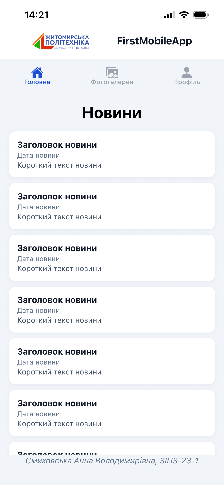
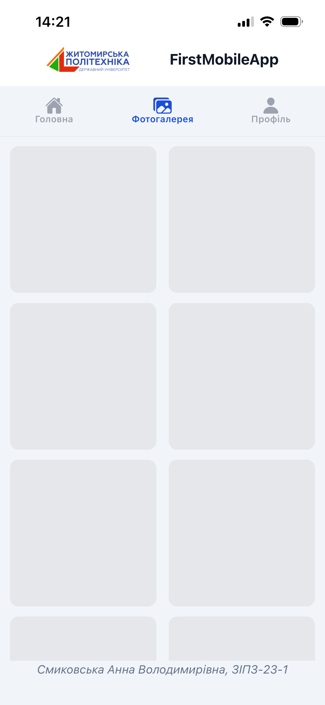
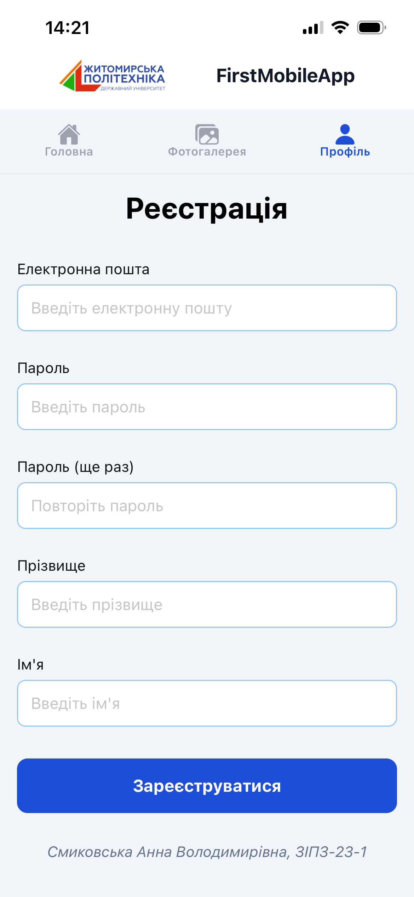

# Лабораторна робота №1
Тема: Використання Expo для створення найпростішого додатку React Native. Знайомство з основними компонентами.

Мета: Навчитися створювати та налаштовувати проєкт у середовищі Expo, ознайомитися зі структурою React Native застосунку та опанувати навички роботи з базовими компонентами.

## Опис проєкту
У застосунку реалізовано навігацію з трьома екранами та використано базові компоненти (`View`, `Text`, `Image`, `Pressable`, `TextInput`, `FlatList`, `ScrollView`, `SafeAreaView`, `Switch`).

Структура репозиторію:
- `lab1/` — вихідний код застосунку

## Інструкція із запуску
1. Перейдіть у папку проєкту:

```bash
cd lab1
```

2. Встановіть залежності (якщо ще не встановлені):

```bash
npm install
```

3. Відкрити Expo Go на телефоні та відсканувати QR-код:

```bash
npx expo start
```

## Основні способи запуску мобільного додатка
1. Фізичний пристрій (Expo Go)
Призначення: швидка перевірка на реальному телефоні без окремих збірок.
Особливості: запуск через Expo Go та QR‑код; потрібна одна мережа для ПК і телефона.
Відмінності під час тестування: найближча до реального користування поведінка (камера, сенсори, продуктивність).

2. Android‑емулятор (Android Studio)
Призначення: тестування без фізичного пристрою та стабільне повторюване середовище.
Особливості: після `npx expo start` натисніть `a`; потребує більше ресурсів ПК.
Відмінності під час тестування: швидкий дебаг, але продуктивність і сенсори можуть відрізнятися від реального девайса.

3. iOS‑симулятор (лише macOS)
Призначення: перевірка iOS‑інтерфейсу без фізичного iPhone.
Особливості: після `npx expo start` натисніть `i`; доступно тільки на macOS.
Відмінності під час тестування: хороший UI‑превʼю, але немає частини апаратних можливостей.

4. Веб‑браузер (Expo Web)
Призначення: швидка перевірка верстки та базової логіки.
Особливості: після `npx expo start` натисніть `w`.
Відмінності під час тестування: не всі мобільні API доступні у браузері, можливі відмінності в поведінці стилів.

## Скріншоти





## Запуск через npm скрипти
У папці `lab1` також доступні команди:

```bash
npm run android
npm run ios
npm run web
```
