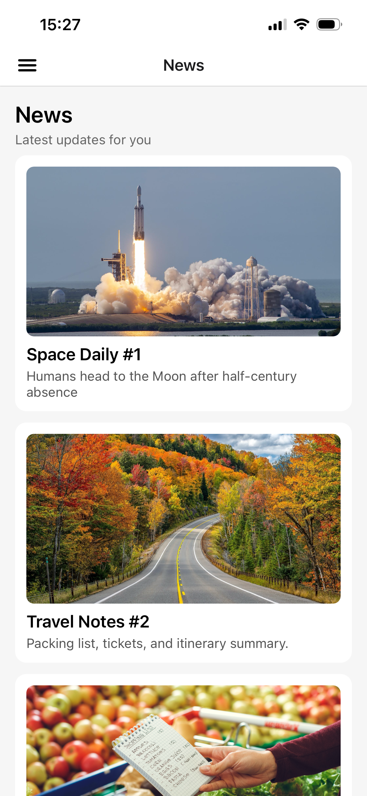
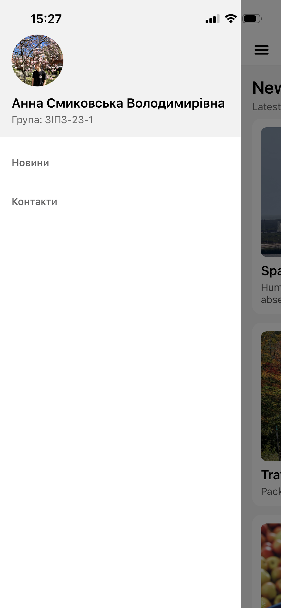
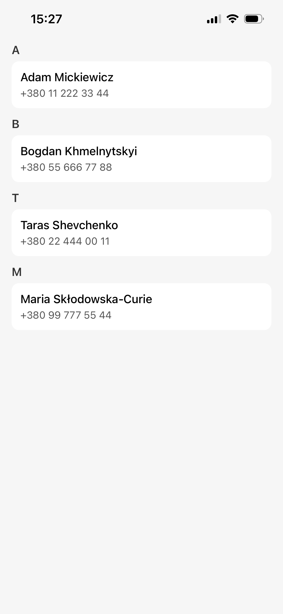

# Лабораторна робота №2
Тема: Побудова вкладеної навігації та оптимізація відображення великих списків у React Native із використанням компонентів FlatList та SectionList.

Мета: Навчитися будувати вкладену навігацію у мобільному застосунку, ознайомитися з архітектурою Drawer та Stack Navigator, опанувати ефективне відображення великих наборів даних за допомогою компонентів `FlatList` та `SectionList`.

## Опис проєкту
У застосунку реалізовано вкладену навігацію (Drawer → Stack), список новин із підтягуванням і безкінечним скролом (`FlatList`), екран контактів із групуванням (`SectionList`) та кастомне бокове меню з аватаром.

Структура репозиторію:
- `lab2/` — вихідний код застосунку

## Інструкція із запуску
1. Перейдіть у папку проєкту:

```bash
cd lab2
```

2. Встановіть залежності (якщо ще не встановлені):

```bash
npm install
```

3. Відкрийте Expo Go на телефоні та відскануйте QR-код:

```bash
npx expo start
```

## Опис реалізованого функціоналу
- **Навігація**
  - Drawer Navigator з кастомним меню (аватар, ПІБ, група, пункти меню).
  - Stack Navigator з екранами `MainScreen` і `DetailsScreen`.
  - Передача параметрів у `DetailsScreen` та динамічний заголовок.
  - Усунення подвійного header-а.
- **MainScreen (FlatList)**
  - Pull-to-Refresh через `refreshing` та `onRefresh` (імітація запиту через `setTimeout`).
  - Infinite Scroll через `onEndReached` і `onEndReachedThreshold`.
  - `ListHeaderComponent`, `ListFooterComponent`, `ItemSeparatorComponent`.
  - Оптимізація: `initialNumToRender`, `maxToRenderPerBatch`, `windowSize`.
- **ContactsScreen (SectionList)**
  - Секції контактів, `renderItem`, `renderSectionHeader`, `keyExtractor`, `ItemSeparatorComponent`.
  - Safe Area для коректного відображення на iPhone з вирізом.

## Скріншоти






## Запуск через npm скрипти
У папці `lab2` також доступні команди:

```bash
npm run android
npm run ios
npm run web
```

## Висновки
У ході виконання лабораторної роботи я набула навичок побудови вкладеної навігації у React Native: поєднання Drawer Navigator та Stack Navigator в єдину структуру, передачі параметрів між екранами та встановлення динамічного заголовку. Також було опановано роботу з компонентами `FlatList` і `SectionList`: реалізацію Pull-to-Refresh, безкінечного скролу та оптимізацію відмалювання списків через `initialNumToRender`, `maxToRenderPerBatch` і `windowSize`. Отримано практичний досвід кастомізації Drawer Menu та коректного відображення контенту на пристроях з вирізом за допомогою `SafeAreaView`.

### Відповіді на контрольні запитання
1. **Чим відрізняється FlatList від ScrollView?** — `ScrollView` рендерить усі елементи одразу, що при великих списках призводить до надмірного споживання памʼяті. `FlatList` використовує віртуалізацію: відмальовує лише видимі елементи та перевикористовує їх під час прокрутки.
2. **Що таке віртуалізація списків?** — Техніка, за якої в DOM/нативному дереві існують лише елементи, що знаходяться у видимій області екрана. Невидимі компоненти вивантажуються з памʼяті та створюються заново при прокрутці.
3. **Як здійснюється передача параметрів між екранами?** — Через другий аргумент `navigation.navigate('ScreenName', { param1, param2 })`. На цільовому екрані параметри отримують з `route.params`.
4. **Що таке вкладена навігація?** — Структура, де один навігатор знаходиться всередині іншого. Наприклад, Stack Navigator всередині Drawer Navigator дозволяє мати бокове меню і водночас послідовну навігацію між екранами.
5. **У яких випадках застосовується SectionList?** — Коли потрібно відобразити список із групуванням за категоріями (наприклад, контакти за буквою алфавіту, товари за розділами). `SectionList` підтримує заголовки секцій та оптимізований рендеринг.
