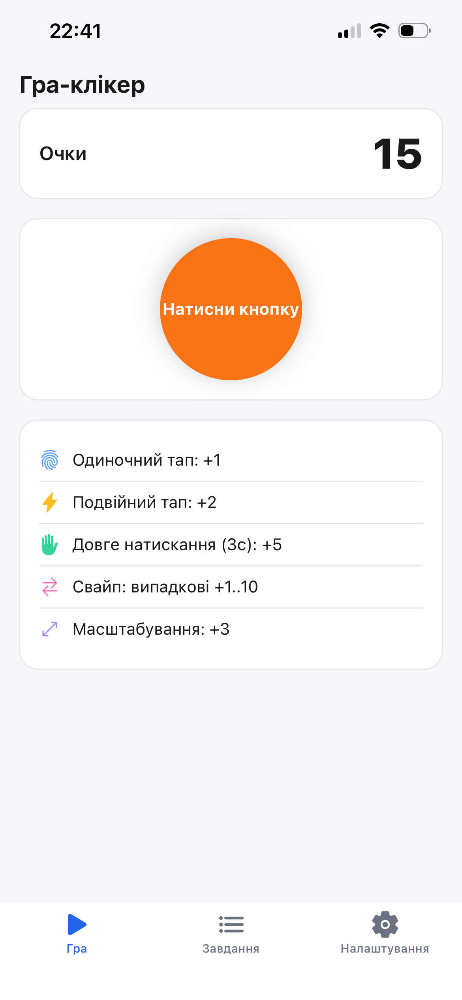
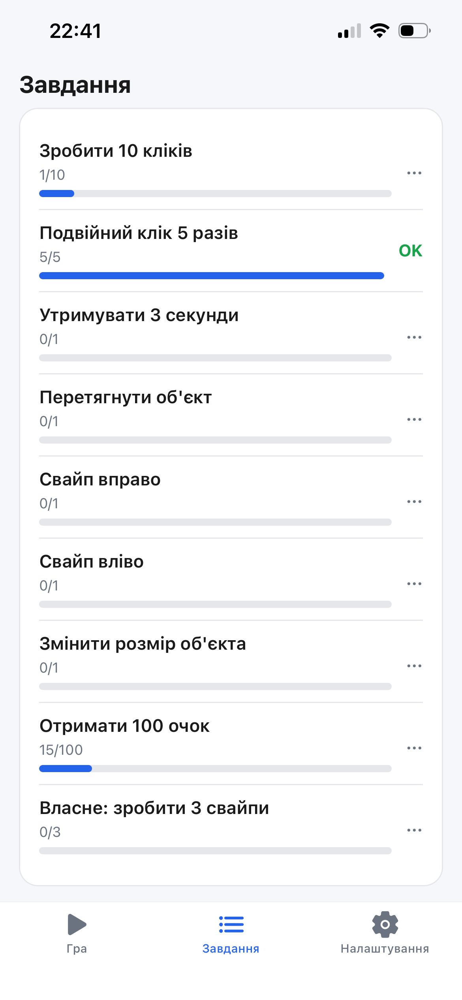
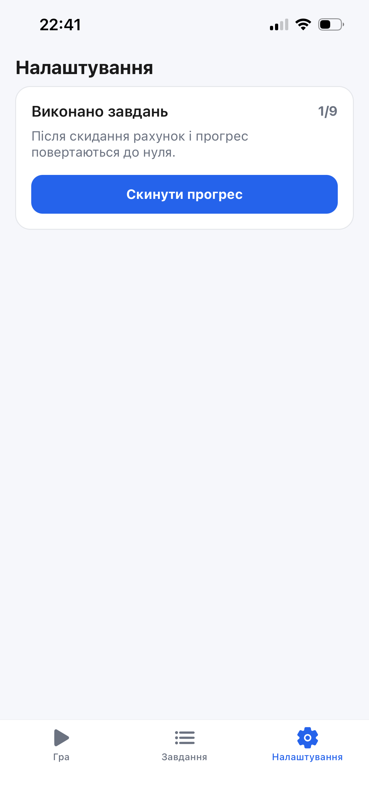

# Лабораторна робота №3
Тема: Використання кастомних жестів у React Native та стилізація інтерфейсу мобільного застосунку.

Мета: Навчитися працювати з жестами користувача у мобільному застосунку, реалізувати взаємодію через різні типи жестів та застосувати сучасні підходи стилізації у React Native.

## Опис проєкту
У застосунку реалізовано мобільну гру-клікер із шістьма типами жестів (`TapGestureHandler`, `LongPressGestureHandler`, `PanGestureHandler`, `FlingGestureHandler`, `PinchGestureHandler`), системою нарахування очок, списком завдань із прогресом та підтримкою світлої й темної теми через Styled Components.

Структура репозиторію:
- `lab3/` — вихідний код застосунку

## Інструкція із запуску
1. Перейдіть у папку проєкту:

```bash
cd lab3
```

2. Встановіть залежності (якщо ще не встановлені):

```bash
npm install
```

3. Відкрийте Expo Go на телефоні та відскануйте QR-код:

```bash
npx expo start
```

## Опис реалізованого функціоналу
- **Навігація**
  - Bottom Tab Navigator з трьома вкладками: Home, Tasks, Settings.
  - Іконки вкладок через `@expo/vector-icons` (Ionicons).
  - `GestureHandlerRootView` огортає весь застосунок для коректної роботи жестів.
- **HomeScreen (головний екран)**
  - Лічильник очок у верхній частині екрана.
  - Інтерактивний об'єкт, що реагує на всі жести одночасно завдяки вкладеним обробникам.
  - Блок підказок з іконками та описом кожного жесту й нарахованих очок.
  - Анімація переміщення (`Animated.ValueXY`) та масштабування (`Animated.Value`) об'єкта.
- **Жести**
  - `TapGestureHandler` (одиночний тап) — +1 очко; використовує `waitFor` для уникнення конфлікту з подвійним тапом.
  - `TapGestureHandler` (`numberOfTaps={2}`, подвійний тап) — +2 очки.
  - `LongPressGestureHandler` (`minDurationMs={3000}`) — +5 очок за утримання 3 секунди.
  - `PanGestureHandler` — перетягування об'єкта по екрану з поверненням у початкову позицію після відпускання.
  - `FlingGestureHandler` (свайп вправо та вліво) — випадкова кількість очок від 1 до 10.
  - `PinchGestureHandler` — масштабування об'єкта, +3 очки при зміні масштабу більше ніж на 10%.
- **TasksScreen (сторінка завдань)**
  - Дев'ять завдань із прогрес-баром і бейджем статусу (OK / …).
  - Завдання: 10 кліків, подвійний клік 5 разів, утримання 3с, перетягування, свайп вправо, свайп вліво, зміна розміру, 100 очок, власне завдання (3 свайпи загалом).
- **SettingsScreen (сторінка налаштувань)**
  - Відображення кількості виконаних завдань із загальної кількості.
  - Кнопка скидання прогресу та рахунку.
- **Стилізація**
  - Styled Components (`styled-components/native`) для всіх UI-елементів.
  - Світла та темна тема визначаються автоматично через `useColorScheme()`.
  - Кольори теми (`bg`, `card`, `text`, `muted`, `accent`, `border`) передаються через `ThemeProvider`.

## Скріншоти





## Запуск через npm скрипти
У папці `lab3` також доступні команди:

```bash
npm run android
npm run ios
npm run web
```

## Висновки
У ході виконання лабораторної роботи я набула навичок роботи з жестами користувача у React Native за допомогою бібліотеки `react-native-gesture-handler`. Було реалізовано шість типів жестових обробників: одиночний і подвійний тап, довге натискання, перетягування, свайп та масштабування. Опановано техніку вкладення обробників для одночасної обробки різних жестів на одному елементі, а також використання `Animated API` для плавної анімації переміщення й масштабування. Отримано практичний досвід стилізації через `styled-components` із підтримкою динамічної зміни теми та побудови Bottom Tab Navigation.

### Відповіді на контрольні запитання
1. **Що таке GestureHandlerRootView і навіщо він потрібен?** — Це кореневий компонент бібліотеки `react-native-gesture-handler`, який має огортати весь застосунок. Без нього жести не оброблятимуться коректно, особливо на Android.
2. **Чим відрізняється PanGestureHandler від FlingGestureHandler?** — `PanGestureHandler` відстежує повільні, плавні рухи й повідомляє поточну позицію пальця. `FlingGestureHandler` реагує на швидкий різкий рух (кидок) у заданому напрямку і спрацьовує лише один раз за жест.
3. **Як уникнути конфлікту між одиночним і подвійним тапом?** — Через пропс `waitFor` у `TapGestureHandler` одиночного тапу: він чекає, поки обробник подвійного тапу не завершиться невдало, і лише тоді підтверджує одиночний тап.
4. **Як Animated API взаємодіє з жестами?** — Обробник жесту повертає об'єкт події з координатами. Ці координати передаються в `Animated.event`, який безпосередньо оновлює `Animated.Value` без перерендеру компонента, що забезпечує плавну анімацію.
5. **Як у React Native реалізується підтримка темної теми?** — За допомогою хука `useColorScheme()`, який повертає `'light'` або `'dark'` залежно від системних налаштувань пристрою. Це значення використовується для вибору об'єкта теми, який передається у `ThemeProvider` зі `styled-components`.
